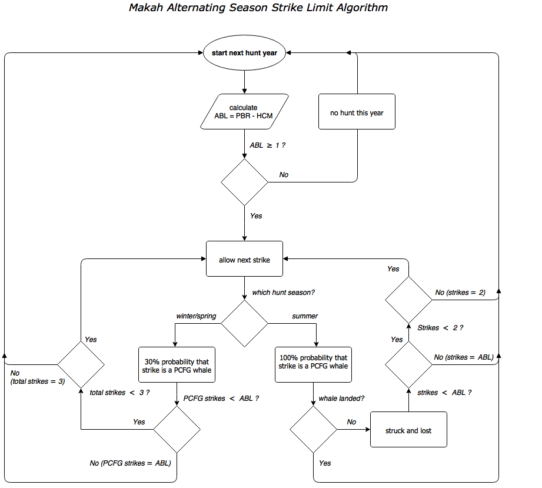

# MakahGW: Management Strategy Evaluation of alternating seasonal hunts for gray whales. 

Original Fortran source code provided courtesy of Andre E. Punt (Univ. of Washington) and Cherry Allison (IWC). That version of the code was used by the most recent Aboriginal Whaling Management Procedure Working Group Gray Whale Implementation Review, as presented to the Scientific Committee of the International Whaling Commission (J Cet Res Manage. 2013. Suppl Annex E). 

This repository is a fork off the 2012 version of the code. The base of the master branch (i.e. the version of files used for the 2012 runs) can be accessed through `git` by cloning this repository and reverting to the first commit (SHA1 80f57d2).    

The developmental version of the code by JRB is on a parrallel branch named, `alt_sla` (c.f. the `master` branch). A flow diagram for this SLA is provided below. For comparison:  

1. The Strike Limit Algorithm for this hunt is based on an alternating season hunt strategy (e.g. odd years hunt in winter with max strike of 3, even years in summer with max strike 2).

2. There are several additional differences between the developmental SLA and that from 2012, including:
	  1.  An absence of block quotas for landed whales.
	  2.  The summer hunt is stopped if one whale is landed. 
	  3.  The annual PCFG Strike Limit can not be greater than ABL = PBR - HCM. 
	      where:  
	      * HCM = Human Caused Mortality (non-hunting, and set equal to 0.40) 
	      * PBR = N_MIN * 0.5 * R_MAX * F_R
	      * N_MIN = 20th percentile of abundance estimate with log-normal sampling error.
	      * R_MAX = 0.062 (Carretta et al. 2015. U.S. Pacific Marine Mammal Stock Assessments)
	      * F_R   = 0.50 for undetermined status relative to the Optimum Sustainable Population level under the U.S. MMPA (Carretta et al. 2015. U.S. Pacific Marine Mammal Stock Assessments)

<p align="center">
  
</p>

## Project notes: 

1. Results from the the version of the code obtained from AEP (i.e. the root commit on the `master` branch) have been checked against those reported during 2012 and found to be identical.    

2. Reasons and corresponding IDs for stopping the hunt (see also the `Reason` vector in code):
     1. 2 strikes total during summer hunt year.
     2. 3 strikes total during winter/spring hunt year. 
     3. PCFG strike limit (ABL) reached.
     4. Landed one whale in summer.

## Shell scripting: 

1. DOS batch files have been ported to Bash scripts (running under Mac OS 10.11.6).
2. See "Examples from the command line", below. 

## GNU Make(file): 

1. Previously, the original set of Fortran code files were compiled using F2-gup2.FOR, which simply contains a list of "INCLUDE" statements for each \*.FOR file to be compiled into the executable.   

2. As an alternative to the use of "INCLUDE" statements, see the `Makefile`. This uses a "MODULAR" approach to compiling, wherein, each \*.FOR code file is compiled first into an object \*.o file. The object files are then linked during the step of compiling the executable. Compiling individual object files can take advantage of GNU Make's strengths, i.e. only modified code files are recompiled when linking the executable. In contrast, the "Include" approach compiles the entire file set indiscriminantly.
     1. An option has been added to the `Makefile` to run individual trials with the `make run` command.
     2. See "Examples from the command line" below for an example of compiling with the `make` command in Bash.

## JB's Dev Environment:
1. OS: Mac OS X El Cap.
2. Shell: GNU bash, version 3.2.57(1)-release (x86\_64-apple-darwin15)
3. GNU Make 3.81
4. Compiler: GNU gcc gfortran 4.2.3 

## __Examples from a Bash command line__:

<p align="center">
  
</p>

### Compiling

``` shell
cd ~/MakahGW      # make sure you are at top of project directory 
make              # compile Fortran 90 code into executable (see Makefile)

``` 

### Run a single trial

``` shell
cd ./f90/Project    # location of executable
chmod a+x main.app  # only needed first time, but you may need to run as 'sudo chmod ...'
./main.app          # run executable for a single trial (input file, copy.dat)

### Alternatively, after you've run chmod (change mode) on main.app
cd ~/MakahGW
make run            # useful tool for debugging
```

### Run a batch of many trials

``` shell
cd ~/MakahGW/bash           # where more of the magic happens
chmod a+x run.sh runset.sh  # grant these scripts execute privelage. see comment above re: 'sudo chmod ...' 
./runset.sh                 # try with a small set first (e.g. say 4 trials), 
                            # before moving onto the full set (72 trials and ~48 mins on 2016 MacBook Pro)
```

### Example ouput in terminal from single trial run

``` shell
-----------------------------------------
--------------------
------------
------
--
                  
CATCH TREATMENT OPTION (MANAGE):   
                    
PAR FILE = GB01D.PAR   
                      
Starting Trials
                        
-> In progress... [#################===]  88% 
Trial Number:           88
Target popln 2 not hit   81.9562963746184        73.1372725000000     
-> In progress... [####################] 100% 
                              
--
------
------------
--------------------
-----------------------------------------

```
