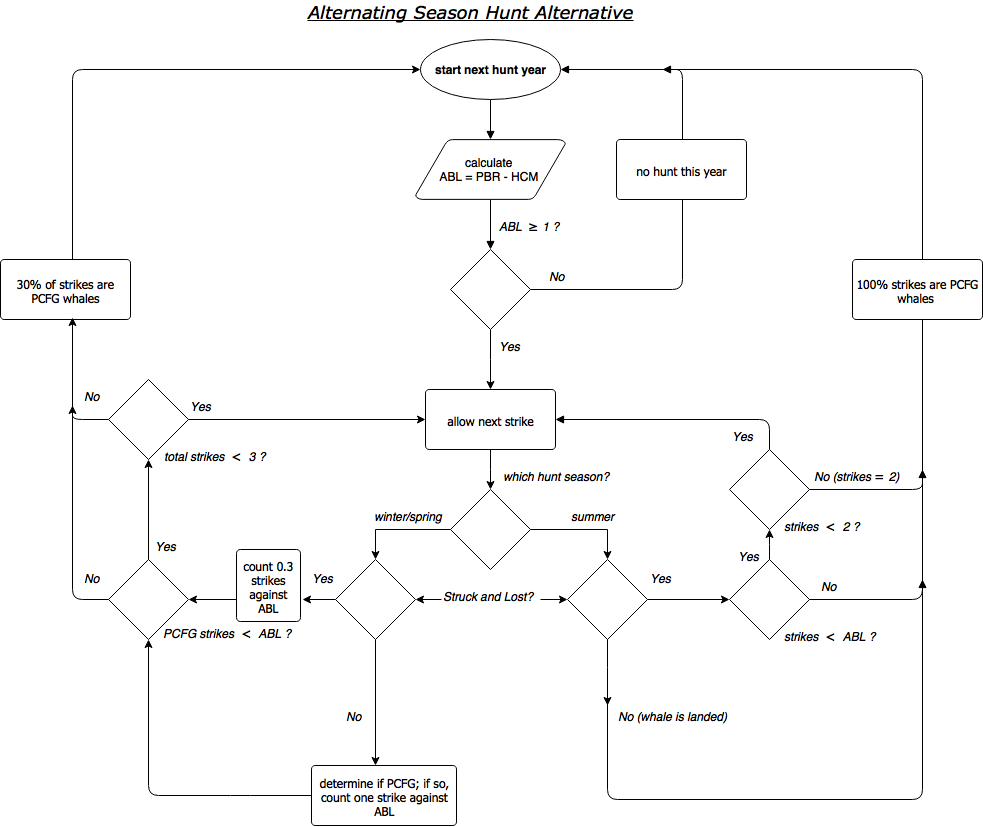
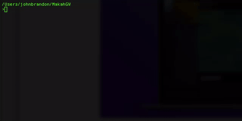

# MakahGW: Management Strategy Evaluation of alternating seasonal hunts for gray whales. 

Original Fortran source code provided courtesy of Andre E. Punt (Univ. of Washington) and Cherry Allison (IWC). That version of the code was used for the most recent Gray Whale Implementation Review, as presented to the Scientific Committee of the International Whaling Commission (J Cet Res Manage. 2013. Suppl Annex E). 

This repository is a fork off the 2012 version of the code. The base of this master branch (i.e. the version of files used for the 2012 runs) can be accessed through `git` by cloning this repository and reverting to the first commit (SHA1 80f57d2). Results from that version of the code have been checked against those reported during 2012 (JCRM 2013 Suppl Annex) and found to be identical.    

The Strike Limit Algorithm for this hunt is based on an alternating season hunt strategy. A flow diagram for this SLA is provided below. 

<p align="center">
  
</p>

There are several differences between this SLA and that from 2012, including:

	- A winter/spring hunt is assumed to occur during even numbered years. 
		-The winter/spring strike limit is 3 gray whales total, regardless of stock.
2. During odd years, a summer hunt occurs. All summer strikes are assumed to be PCFG whales. 
3. The summer hunt is stopped if either: (a)  one whale is landed, or (b) there are two strikes, or (c) the Strike Limit for PCFG whales is reached (struck and lost whales are counted as deaths regardless of season).
4. The alternating season hunt does not have a block quota, e.g. no 10 yr block limit on strikes.
5. The annual PCFG Strike Limit in both seasons is calculated as `ABL = PBR - HCM`.  
Where:  
  * `HCM`   = Human Caused Mortality (non-hunting, and set equal to 0.40). The ABL from 2012 did not subtract HCM from PBR. 
  * `PBR    = N_MIN * 0.5 * R_MAX * F_R`
    * `N_MIN` = 20th percentile of abundance estimate with log-normal sampling error (i.e. the lower bound of a 60% confidence interval).
    * `R_MAX` = 0.062 (Carretta et al. 2015. U.S. Pacific Marine Mammal Stock Assessments).
    * `F_R`   = 0.50 for undetermined status relative to the Optimum Sustainable Population level under the U.S. MMPA (Carretta et al. 2015).

<!--
## Project notes: 
1. Reasons and corresponding IDs for stopping the hunt (see also the `Reason` vector in `*.FOR` code):
     1. 2 strikes during summer hunt year.
     2. 3 strikes total during winter/spring hunt year. 
     3. PCFG strike limit (ABL) reached.
     4. Landed one whale in summer.
-->

## JB's Environment:
1. OS: Mac OS 10.11.6 (El Cap).
2. Shell: GNU bash, version 3.2.57(1)-release (x86\_64-apple-darwin15)
3. GNU Make 3.81
4. Compiler: GNU gcc gfortran 4.2.3 

## __Examples from a Bash command line__:

<p align="center">
  
</p>

## GNU Make(file): 
1. Previously, the original set of Fortran code files were compiled using F2-gup2.FOR, which simply contains a list of "INCLUDE" statements for each \*.FOR file to be compiled into the executable.   

2. As an alternative to the use of "INCLUDE" statements, see the `Makefile`. This uses a "MODULAR" approach to compiling, wherein, each \*.FOR code file is compiled first into an object \*.o file. The object files are then linked during the step of compiling the executable. Compiling individual object files can take advantage of GNU Make's strengths, i.e. only modified code files are recompiled when linking the executable. In contrast, the "Include" approach compiles the entire file set indiscriminantly.

### Compiling
``` shell
cd ~/MakahGW      # make sure you are at top of project directory 
make              # compile Fortran 90 code into executable (see targets and dependencies in Makefile)
``` 

### Run a single trial
``` shell
chmod a+x ./f90/main.app  # only needed first time, but you may need to run as 'sudo chmod ...'
make run                  # An option has been added to the `Makefile` to run individual trials with the `make run` command
                          # useful tool for debugging  
```

### Run a batch of many trials

``` shell
cd ~/MakahGW/bash           # where more of the magic happens
chmod a+x run.sh runset.sh  # grant these scripts execute privelage. see comment above re: 'sudo chmod ...' 
./runset.sh                 # recommend running with a small  set first (e.g. say 4 trials), 
                            # before moving onto the full set (72 trials and ~48 mins on 2016 MacBook Pro)
```

### __Run a batch of all trials from 2012__
```shell
Rscript ./R/Tables_Check.R  #  This R script will read the list of trials from 2012, 
                            # write a Bash script for those and then run it.
```

### Example ouput in terminal from single trial run

``` shell
-----------------------------------------
--------------------
------------
------
--
                  
CATCH TREATMENT OPTION (MANAGE):   
                    
PAR FILE = GB01D.PAR   
                      
Starting Trials
                        
-> In progress... [#################===]  88% 
Trial Number:           88
Target popln 2 not hit   81.9562963746184        73.1372725000000     
-> In progress... [####################] 100% 
                              
--
------
------------
--------------------
-----------------------------------------

```
