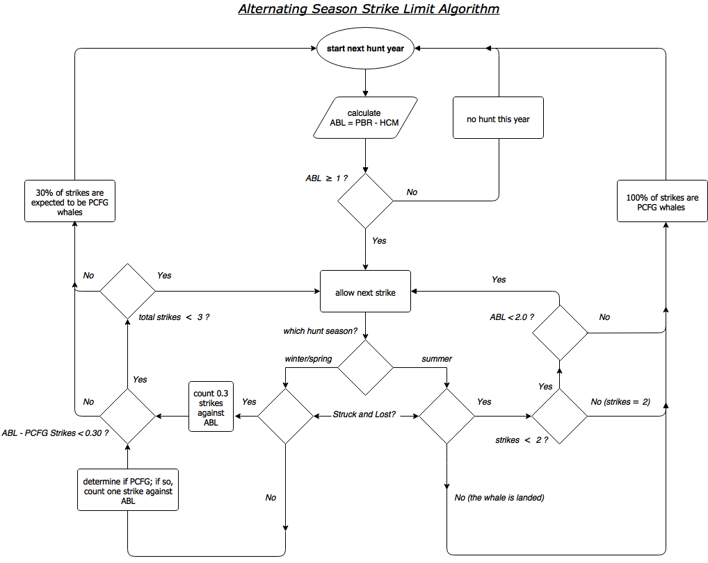

# MakahGW: Management Strategy Evaluation of alternating seasonal hunts for gray whales. 

Original Fortran source code provided courtesy of Andre E. Punt (Univ. of Washington) and Cherry Allison (IWC). That version of the code was used for the most recent Gray Whale Implementation Review, as presented to the Scientific Committee of the International Whaling Commission (J Cet Res Manage. 2013. Suppl Annex E). 

This repository is a fork off the 2012 version of the code. The base of this master branch (i.e. the version of files used for the 2012 runs) can be accessed through `git` by cloning this repository and reverting to the first commit (SHA1 80f57d2). Results from that version of the code have been checked against those reported during 2012 (JCRM 2013 Suppl Annex) and found to be identical.    

The Strike Limit Algorithm for this hunt is based on an alternating season hunt strategy. A flow diagram for this SLA is provided below. 

<p align="center">
  
</p>

Additional notes are provided in the README.MD files under the subdirectories of this repository, *e.g.* `./R/README.MD` provides file descriptions for the R language scripts used to wrangle data.frames, summerize statistics and generate plots from simulation output.

## There are several differences between this SLA and that from 2012, including:

  * A winter/spring hunt is assumed to occur during even numbered years. 
    * The base-case probability of striking a PCFG whale is 0.3
    * The winter/spring hunt is stopped if either:   
      * There are 3 strikes, regardless of stock.
      * The number of PCFG strikes exceeds ABL:
        * struck and lost count as 0.3 PCFG against the ABL;
        * landed PCFG count as 1.0 against the ABL.
  * During odd years, a summer/fall hunt occurs. 
    * All summer strikes are assumed to be PCFG whales. 
    * The summer/fall hunt is stopped if either: 
      * one whale is landed, or 
      * there are two strikes.
  * The alternating season hunt does not have block quotas, e.g. no 10-year-block limit on strikes; however, the 
  * The annual PCFG Strike Limit in both seasons is calculated as `ABL = PBR - HCM`.  
    * Where:  
      * `HCM`   = Human Caused Mortality (non-hunting, and for the base-case set equal to 0.40). 
        * The ABL evaluated during the 2012 IWC IR did not subtract HCM from PBR (although HCM was subtracted from the PCFG abundance to mimick reality). 
      * `PBR    = N_MIN * 0.5 * R_MAX * F_R`
      * `N_MIN` = 20th percentile of the most recent abundance estimate (given log-normal sampling error). Base case, same abundance time series as used by the IWC in 2012.
      * `R_MAX` = 0.062 (Carretta et al. 2015. U.S. Pacific Marine Mammal Stock Assessments). 
        * `R_MAX` was set to 0.04 when calculating limits during the 2012 IWC IR.
      * `F_R`   = 0.50 for undetermined status relative to the Optimum Sustainable Population level under the U.S. MMPA (Carretta et al. 2015).
        * `F_R` was set to 1.0 when calculating limits during the 2012 IWC IR.
 
## Reasons and corresponding IDs for stopping the hunt (see also the `Reason` vector in `*.FOR` code):
     0. ABL is less than 1.0
     1. Limit of 2 strikes during summer/fall hunt reached.
     2. Limit of 3 strikes during winter/spring hunt reached. 
     3. 1 strike taken during summer/fall hunt, and ABL is less than 2.0.
     4. Next strike could exceed ABL during winter/spring hunt. 
     5. Landed one whale during summer/fall hunt on first strike.
     6. Landed one whale during summer/fall hunt on second strike.
-->

## JB's Environment:
1. OS: Mac OS 10.11.6 (El Cap).
2. Shell: GNU bash, version 3.2.57(1)-release (x86\_64-apple-darwin15)
3. GNU Make 3.81
4. Compiler: GNU gcc gfortran 4.2.3 

## __Examples from a Bash command line__:

<p align="center">
  
</p>

## GNU Make(file): 
1. Previously, the original set of Fortran code files were compiled using F2-gup2.FOR, which simply contains a list of "INCLUDE" statements for each \*.FOR file to be compiled into the executable.   

2. As an alternative to the use of "INCLUDE" statements, see the `Makefile`. This uses a "MODULAR" approach to compiling, wherein, each \*.FOR code file is compiled first into an object \*.o file. The object files are then linked during the step of compiling the executable. Compiling individual object files can take advantage of GNU Make's strengths, i.e. only modified code files are recompiled when linking the executable. In contrast, the "Include" approach compiles the entire file set indiscriminantly.

### Compiling
``` shell
cd ~/MakahGW      # make sure you are at top of project directory 
make              # compile Fortran 90 code into executable (see targets and dependencies in Makefile)
``` 

### Run a single trial
``` shell
chmod a+x ./f90/main.app  # only needed first time, but you may need to run as 'sudo chmod ...'
make run                  # An option has been added to the `Makefile` to run individual trials with the `make run` command
                          # useful tool for debugging  
```

### Run a batch of many trials

``` shell
cd ~/MakahGW/bash           # where more of the magic happens
chmod a+x run.sh runset.sh  # grant these scripts execute privelage. see comment above re: 'sudo chmod ...' 
./runset.sh                 # recommend running with a small  set first (e.g. say 4 trials), 
                            # before moving onto the full set (72 trials and ~48 mins on 2016 MacBook Pro)
```

### __Run a batch of all trials from 2012__
```shell
Rscript ./R/Tables_Check.R  #  This R script will read the list of trials from 2012, 
                            # write a Bash script for those and then run it.
```

### Example ouput in terminal from single trial run

``` shell
-----------------------------------------
--------------------
------------
------
--
                  
CATCH TREATMENT OPTION (MANAGE):   
                    
PAR FILE = GB01D.PAR   
                      
Starting Trials
                        
-> In progress... [#################===]  88% 
Trial Number:           88
Target popln 2 not hit   81.9562963746184        73.1372725000000     
-> In progress... [####################] 100% 
                              
--
------
------------
--------------------
-----------------------------------------

```
