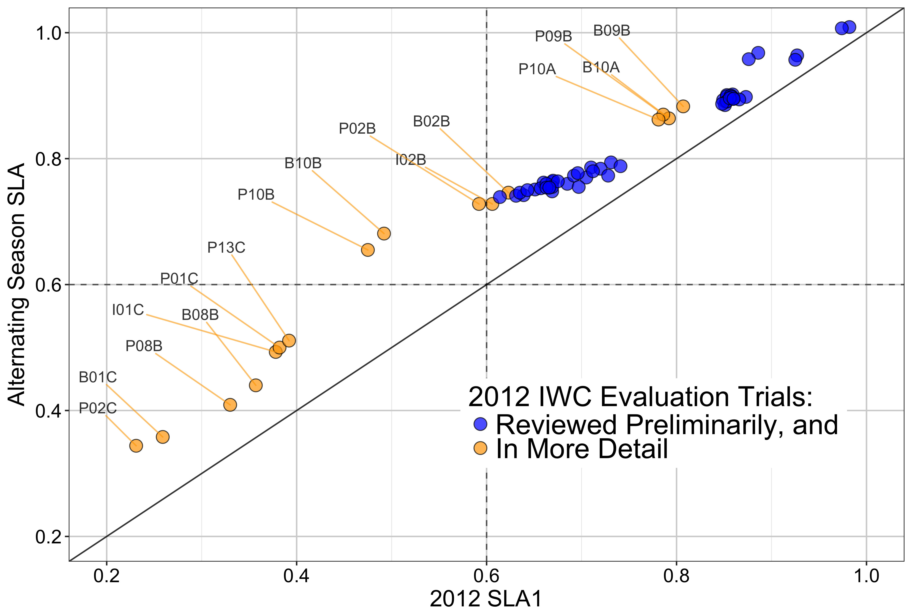
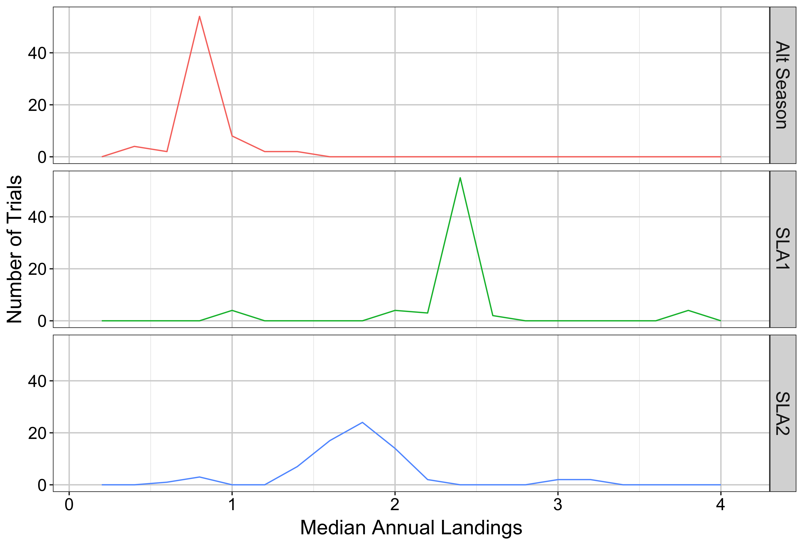

# Figures 

`FlowChart.png` and higher resolution `FlowChart_4x_12pt.png` for alternating seasonal hunt strike limit algorithm created using [www.draw.io](wwww.draw.io). The `XML` files should be editable in a browser through their web app. 

The remaining `*.png` files plot results and performance comparisons between strike limit algorithms. 

